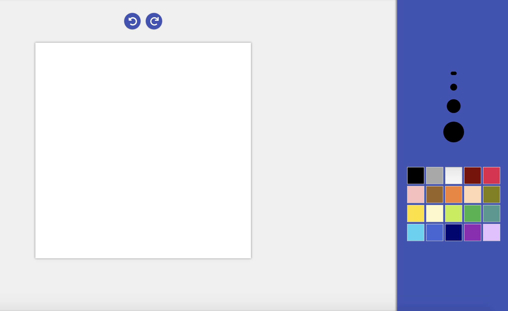

# Paint-App documentation
Paint application created with reactJs, tested with Jest + enzyme.

## Intro

this application simulates the well-known application of microsoft "paint". 
In it we can perform this functions:

- Draw
- Select line width
- Select color
- Undo and redo functions.

## ScreenShot




# Technical description
The application is a web application that is designed to run in a browser environment, but structured and composed to be able to adapt in other environments and prepared for future extensions. It consists of a ReactJS interface, which renders a 2D type canvas.
To test we use Jest, but to test its components in React we need Enzyme and its adapter for react 16.
In addition, the Jest-canvas-mock library is necessary to simulate a canvas for Jest to accept the properties of its context (ctx).

## Getting Started

1. Install the dependencies

```sh
npm i
```

2. Building the distribution package

```sh
npm run build
```

3. Run the application

```sh
yarn start
```


## Test

1. Launches the test runner.

```sh
yarn test
```

## Documentation used

- Jest https://jestjs.io/docs/en/getting-started
- Enzyme https://airbnb.io/enzyme/docs/installation/
- jest-canvas-mock https://www.npmjs.com/package/jest-canvas-mock

## Created by

- [LluisBagur](https://github.com/LluisBagur)